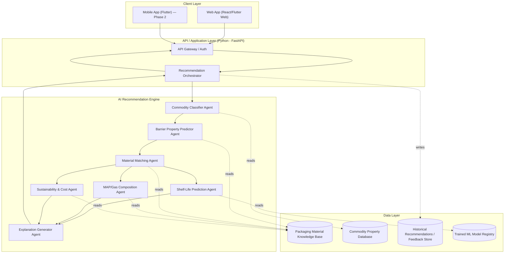

# 2. System Architecture

## 2.1 High-Level Architecture

## 2.2 Layer Description

### Client Layer
- **Web App**: primary interface — commodity/condition input form, results dashboard with recommended materials, spec sheet, and explanation panel.
- **Mobile App (Flutter)**: same functionality for field use by farmers/FPOs; built as a thin client over the same REST API (Phase 2+).

### API / Application Layer
- **API Gateway**: request validation, authentication (if multi-tenant), rate limiting.
- **Recommendation Orchestrator**: coordinates the agent pipeline (see `04_AI_Agents_Design.md`), assembles the final response, and logs the interaction for future model retraining.

### AI Recommendation Engine
A pipeline of specialized agents (rule-based + ML), each responsible for one decision sub-problem. Kept modular so any single agent (e.g., shelf-life model) can be retrained or swapped without touching the rest of the pipeline.

### Data Layer
- **Packaging Material Knowledge Base**: structured properties of each material family (OTR/WVTR ranges, thickness ranges, cost tier, recyclability, typical use cases).
- **Commodity Property Database**: reference properties for common commodities (used to auto-fill/validate user input, especially respiration rate for produce).
- **Historical Recommendations / Feedback Store**: logs of past recommendations + any user feedback or lab-verified outcomes, used to improve the ML models over time.
- **Model Registry**: versioned trained models (shelf-life predictor, material classifier).

## 2.3 Suggested Tech Stack

| Layer | Technology |
|---|---|
| Front-end (web) | React (or Flutter Web for single codebase with mobile) |
| Front-end (mobile) | Flutter |
| Backend/API | Python, FastAPI |
| AI/ML | scikit-learn / XGBoost for tabular prediction (shelf-life, material ranking); rule engine (e.g., a lightweight decision-table module) for hard constraints (e.g., frozen storage → excludes certain films) |
| Database | PostgreSQL (relational — commodities, materials, specs); Redis (caching frequent lookups) |
| Model serving | FastAPI endpoint wrapping the trained model, or a lightweight MLflow/BentoML setup |
| Deployment | Docker containers; any cloud (AWS/GCP/Azure) or on-prem for pilot deployments |

## 2.4 Design Principles

1. **Hybrid, not pure black-box**: hard food-safety/physical constraints (e.g., "frozen storage excludes non-freezer-grade films") are enforced by explicit rules; ML is used for ranking/optimization within the constrained candidate set. This keeps the system auditable — important for a food-safety-adjacent tool.
2. **Explainability by design**: every recommendation carries a reason trace (which rule fired, which property drove the match) — not just a score.
3. **Modular agents**: each agent has one responsibility and a clean input/output contract, so agents can be improved independently (see `04_AI_Agents_Design.md`).
4. **Extensible knowledge base**: the packaging material and commodity databases are the real IP of the system — architected so new materials/commodities can be added without code changes.
