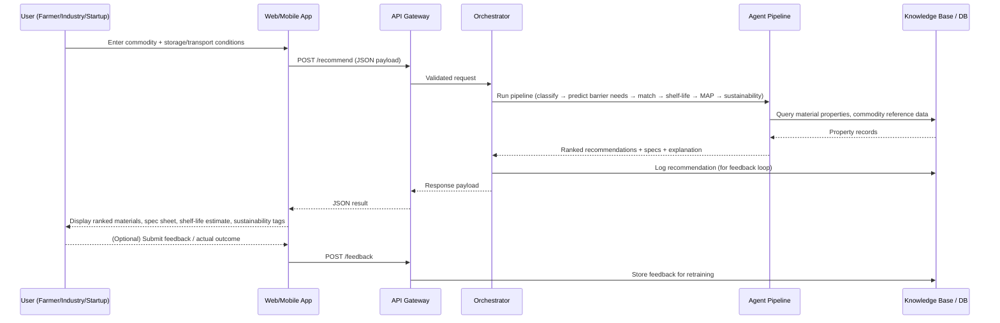

# 3. Data Flow

## 3.1 End-to-End Sequence



## 3.2 Input Payload (example contract)

```json
{
  "commodity": {
    "name": "Tomato",
    "category": "fresh_produce",
    "moisture_content_pct": 94.5,
    "fat_content_pct": 0.2,
    "ph": 4.3,
    "respiration_rate_ml_co2_per_kg_hr": 15
  },
  "requirements": {
    "desired_shelf_life_days": 14
  },
  "environment": {
    "storage_type": "chilled",
    "storage_temp_c": 8,
    "relative_humidity_pct": 90,
    "transport_mode": "refrigerated_truck",
    "transport_duration_hr": 24
  }
}
```

## 3.3 Output Payload (example contract)

```json
{
  "recommendations": [
    {
      "material": "Micro-perforated LDPE film",
      "confidence": 0.88,
      "specs": {
        "otr_cc_m2_day": "3000-8000",
        "wvtr_g_m2_day": "5-15",
        "thickness_micron": "30-50",
        "sealability": "heat-sealable",
        "map_suitable": true,
        "map_gas_mix": {"O2_pct": 5, "CO2_pct": 5, "N2_pct": 90}
      },
      "predicted_shelf_life_days": 13,
      "sustainability": {"recyclable": true, "biodegradable": false, "tier": "medium"},
      "explanation": "High respiration rate and chilled storage require a breathable film with moderate OTR to prevent anaerobic buildup while limiting moisture loss."
    }
  ],
  "alternatives": ["..."]
}
```

## 3.4 Data Flow Notes

- **Validation before AI**: unit ranges (e.g., pH 0–14, RH 0–100%) are validated at the API layer before hitting the agent pipeline, to fail fast on bad input.
- **Caching**: repeated queries for the same commodity+condition combination are cached (Redis) since the recommendation is deterministic given the same input and model version.
- **Feedback loop**: user/lab-verified outcomes are the mechanism by which the shelf-life model and material ranking improve over time — this is what turns the system from a static rule engine into a learning system.
