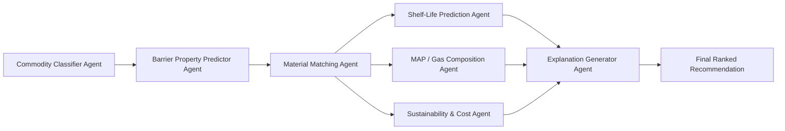

# 4. AI Agent Pipeline — Detailed Design

The recommendation engine is decomposed into single-responsibility agents chained by the Orchestrator. Each agent is described below with: purpose, inputs, outputs, and suggested implementation approach (rules vs ML).

## 4.1 Pipeline Overview

## 4.2 Agent Specifications

### 4.2.1 Commodity Classifier Agent
- **Purpose**: Normalize raw commodity input into a known category (fresh produce, dairy, meat/poultry, bakery, dry/staple, oil/fat-rich, ready-to-eat) using the commodity name/properties.
- **Input**: commodity name, moisture %, fat %, pH.
- **Output**: `commodity_category`, `spoilage_risk_profile` (e.g., "high-moisture, low-pH, respiring").
- **Implementation**: Rule-based lookup against the Commodity Property Database first; falls back to a simple classifier (e.g., k-NN or decision tree on moisture/fat/pH) if the commodity isn't in the reference table.

### 4.2.2 Barrier Property Predictor Agent
- **Purpose**: Translate the spoilage risk profile + environment into required barrier property *bands* (not yet a material — just "what OTR/WVTR range is needed").
- **Input**: `commodity_category`, `spoilage_risk_profile`, storage temp, RH, storage type, respiration rate.
- **Output**: target OTR range, target WVTR range, moisture-sensitivity flag, oxidation-sensitivity flag.
- **Implementation**: Rule/decision-table driven (food-science derived thresholds), e.g.: high respiration rate → needs a defined OTR floor (not too low, or the produce suffocates); high fat content → needs low OTR (oxidation risk); high moisture differential vs. storage RH → needs low WVTR.

### 4.2.3 Material Matching Agent
- **Purpose**: Query the Packaging Material Knowledge Base for materials whose OTR/WVTR/thickness/mechanical properties fall within the target bands from 4.2.2, then rank them.
- **Input**: target barrier bands, storage/transport mechanical stress indicators (drop risk, stacking, transport duration).
- **Output**: ranked candidate list of materials (LDPE, HDPE, PET, metalized film, foil laminate, biodegradable film, breathable/micro-perforated film) with a confidence score.
- **Implementation**: Hybrid — hard filter (rule-based: exclude materials outside physically required bands) followed by an ML ranker (e.g., gradient-boosted model trained on historical recommendation/outcome data) to order the remaining candidates by fit.

### 4.2.4 Shelf-Life Prediction Agent
- **Purpose**: Estimate expected shelf life for a given (commodity, material, environment) combination.
- **Input**: commodity properties, chosen material's barrier specs, storage temp/RH.
- **Output**: predicted shelf-life range (days), confidence interval.
- **Implementation**: Regression model (e.g., XGBoost/Random Forest) trained on shelf-life literature data + historical feedback; falls back to food-science heuristic formulas (e.g., Arrhenius-based temperature scaling) when data for a commodity is sparse.

### 4.2.5 MAP / Gas Composition Agent
- **Purpose**: For respiring produce, determine whether Modified Atmosphere Packaging is beneficial and, if so, recommend an O₂/CO₂/N₂ mix.
- **Input**: respiration rate, commodity category, target shelf life, chosen film's gas permeability.
- **Output**: `map_suitable` (bool), recommended gas mix percentages.
- **Implementation**: Rule-based lookup table keyed by commodity category (well-documented MAP recipes exist per produce type in food-science literature), with permeability cross-check against the chosen film.

### 4.2.6 Sustainability & Cost Agent
- **Purpose**: Tag each candidate material with recyclability/biodegradability and a relative cost tier.
- **Input**: material identity (from Material Matching Agent).
- **Output**: `recyclable` (bool), `biodegradable` (bool), `cost_tier` (low/medium/high — relative, not live pricing in v1).
- **Implementation**: Static lookup against the Knowledge Base (each material record carries these attributes).

### 4.2.7 Explanation Generator Agent
- **Purpose**: Compose a human-readable justification tying the final recommendation back to the specific input properties that drove it.
- **Input**: outputs of all upstream agents + which rules fired.
- **Output**: natural-language explanation string per recommendation.
- **Implementation**: Template-based generation from the rule/feature trace (no LLM required for v1; an LLM can be swapped in later for richer phrasing without changing the underlying logic).

## 4.3 Why Agents Instead of One Monolithic Model

- **Auditability**: food-safety-adjacent recommendations need to be explainable; a single opaque model is harder to justify to an industry user or auditor.
- **Independent iteration**: the shelf-life model can be retrained as more data arrives without touching the material-matching rules.
- **Graceful degradation**: if the ML ranker has no data for an unusual commodity, the rule-based hard filter still returns a physically valid (if less optimized) candidate set.
