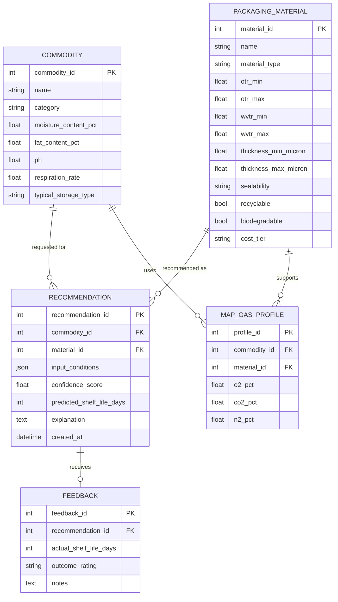

# 5. Data Model & Knowledge Base

## 5.1 Entity-Relationship Overview

## 5.2 Core Tables

### `commodity`
Reference data for known commodities — used both to validate/auto-fill user input and as training data for the classifier.

### `packaging_material`
The core knowledge base table. Each row is a material family (not a specific vendor product) with its typical barrier property ranges. This table is the primary thing subject-matter experts (food packaging specialists) should be able to review/edit — consider a lightweight admin UI or a versioned CSV/spreadsheet import pipeline for this in early phases.

### `map_gas_profile`
Pre-validated MAP gas mix recipes per commodity category, cross-referenced against compatible films.

### `recommendation`
Every recommendation served is logged with the full input JSON — this is what feeds the feedback loop and model retraining.

### `feedback`
Optional but valuable: actual observed shelf life or industry-reported outcome, linked back to the recommendation that was given. This is the ground truth for improving the shelf-life model over time.

## 5.3 Knowledge Base Seeding Strategy

1. **Phase 1**: Seed `packaging_material` and `map_gas_profile` from published food-packaging science literature and standard industry references (a domain expert / food-tech advisor review is strongly recommended before production use, given food-safety implications).
2. **Phase 2**: Seed `commodity` with common fruits/vegetables, dairy, meat, and dry-goods reference properties.
3. **Ongoing**: Grow `recommendation` + `feedback` from real usage to train and validate the ML ranking/shelf-life models.
