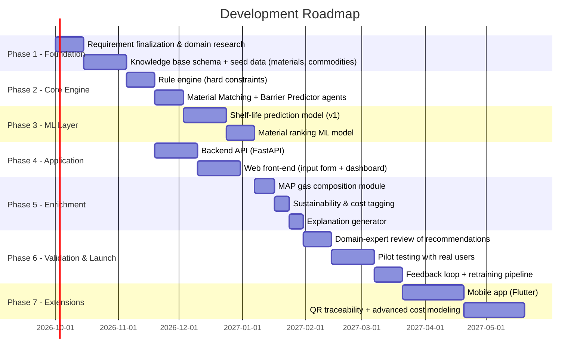

# 6. Development Phases & Roadmap

## 6.1 Phase Timeline (indicative)

## 6.2 Phase-Wise Breakdown

### Phase 1 — Foundation (Research & Data)
- Finalize the exact list of supported commodities and packaging material families for v1.
- Consult/validate against food-packaging science literature (and ideally a domain expert) for the OTR/WVTR/thickness bands per material and per commodity category.
- Design and populate the initial knowledge base (`packaging_material`, `commodity`, `map_gas_profile` tables).
- **Deliverable**: populated database + data dictionary.

### Phase 2 — Core Rule-Based Engine
- Implement the Commodity Classifier, Barrier Property Predictor, and Material Matching agents as a pure rule/decision-table system (no ML yet) — this alone is already usable as an MVP decision-support tool.
- **Deliverable**: working rule engine producing valid material recommendations from structured input.

### Phase 3 — Machine Learning Layer
- Collect/curate training data for shelf-life prediction (literature + any pilot feedback).
- Train and validate the shelf-life regression model and the material-ranking model.
- Integrate as a re-ranking/refinement layer on top of the Phase 2 rule engine (hybrid approach, per architecture doc).
- **Deliverable**: trained models with documented accuracy/validation metrics.

### Phase 4 — Application Layer
- Build the FastAPI backend exposing `/recommend` and `/feedback` endpoints.
- Build the web front-end: input form, results dashboard, explanation panel.
- **Deliverable**: end-to-end working web application (can run in parallel with Phase 2/3).

### Phase 5 — Feature Enrichment
- Add the MAP/gas composition agent for respiring produce.
- Add sustainability tagging (recyclable/biodegradable) and relative cost tiering.
- Add the explanation generator for transparent recommendations.
- **Deliverable**: feature-complete v1 recommendation output matching the full spec in the problem statement.

### Phase 6 — Validation & Pilot Launch
- Domain-expert review of a sample of recommendations for correctness/safety.
- Pilot with a small set of real users (a food startup, a farmer group, or a college food-tech lab).
- Wire up the feedback store and a basic retraining pipeline.
- **Deliverable**: validated, pilot-tested v1 system + retraining process.

### Phase 7 — Extensions (Post-v1)
- Flutter mobile app wrapping the same backend API.
- QR-based traceability across the supply chain.
- Deeper cost optimization (live vendor pricing integration).
- IoT/sensor integration for real-time spoilage monitoring (long-term).

## 6.3 Suggested Team Roles

| Role | Responsibility |
|---|---|
| Backend/ML engineer(s) | API, agent pipeline, ML models |
| Front-end engineer | Web (and later mobile) client |
| Domain/food-science advisor | Validates knowledge base and rule thresholds |
| Data curator | Sources and structures the packaging material + commodity reference data |
